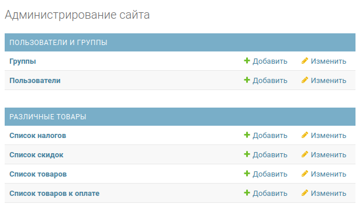

# Django_stripe_service

#### Веб-сервис, позволяющий оплачивать выбранные товары через платежную систему Stripe.
___
## Site page examples

#### Главная страница:


#### Выбор товара для оплаты:

 

#### Корзина с выбранными товарами, учитывающая налогообложение и скидочные купоны:


#### Пример отображения формы оплаты единичного товара и списка выбранных товаров:


#### Панель администратора:



___

## Installation

#### Заполните файл .env в соотвествии с образцом по адресу:

```bash
djstrippr/djstrippr/.env
```

#### Выполните следующую команду:

```bash
docker-compose up 
```

#### Войдите в контейнер приложения:

```bash
docker-compose exec web sh
```

#### Создайте и выполните миграции:
```bash
python manage.py makemigrations
python manage.py migrate
```

#### Создайте суперпользователя:
```bash
python manage.py createsuperuser
```
___

#### Заполните данные через панель администратора и приступайте к использованию!

___
## Published version
[Django-stripe-service](http://pashokpl.beget.tech/)
